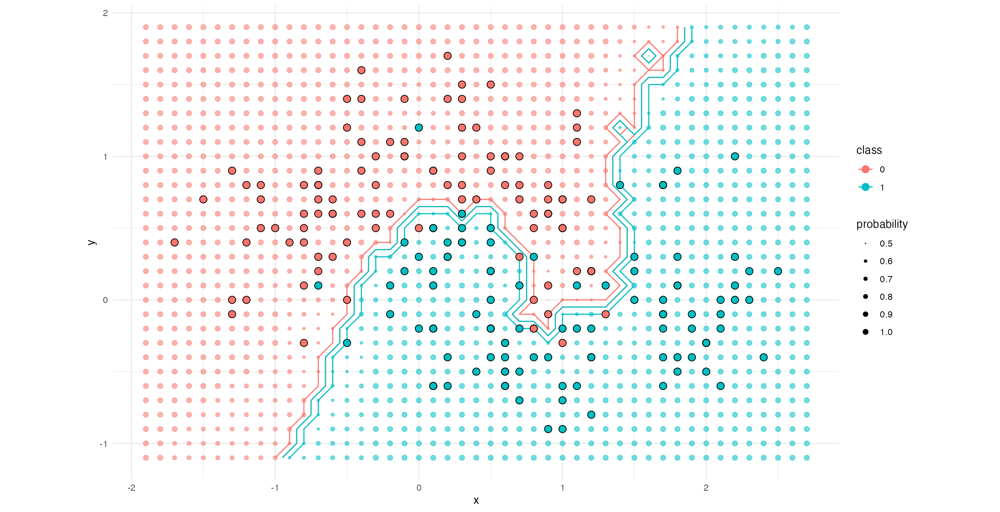

# Getting started with Shiny

Interactive graphics can help us handle complexity by allowing users to interact with the data. Here we're going to explore a popular way of doing this in R, using the Shiny package.

## Intended learning outcomes
After this practical, you should be able to:
* explain the principles of the Shiny package
* use Shiny to make interactive data graphics

## Getting started

In this session, we’ll be using the R package Shiny to build an interactive web app. Although using Shiny means you don’t have to worry about coding HTML, Javascript or CSS (all the code is R), there are some concepts common to other web apps that you’ll need to appreciate what’s going on. We’ll introduce those as they appear below. First of all, create a new Shiny app in R Studio:

```File -> New File -> Shiny Web App …```

Choose a name for the app, and where you’d like it to live. You’ll see that R Studio has helped us by giving us the boilerplate code necessary to get a Shiny app running, and populates it with data on the eruption of the Old Faithful Geyser in Yellowstone Park, USA. Before we get into how the code works, hit the “Run App” button at the top of the screen and play around with the demo app.

## The structure of a Shiny app

You’ll see that Shiny has generated a web page with two sections: a histogram, and a slider to adjust the number of bins in the histogram. This is the User Interface, or UI, often called the front end. If you look at the R Studio console, you’ll notice that you can’t enter anything because it’s currently running an R server that’s listening out for your inputs on the front end slider and responding by updating the graph; this server is often called the back end. When you write a Shiny app, you’ll specify:

* how you want the UI to appear and what levers you want to give the user to play with the data
* what processing you’d like the server to do
* how the two should talk to each other

Let’s go back to the R code now. After loading the Shiny package, you’ll see that there are two main sections to the code: a `ui` object, and a `server` object, which correspond to the two main parts of a web app discussed above. The last line of the code runs the application.

Looking more closely at the `ui` object, you’ll see that the code is to do with the layout of the page and the user inputs. Within the `fluidPage`, there’s a `titlePanel`, followed by a `sidebarLayout` that contains a `sidebarPanel` with the user input slider, then a `mainPanel` that contains the `plotOutput`, in this case a histogram. Note that both the `sliderInput` and the `plotOutput` have names: `bins` and `distPlot`.

Looking at the server object now, you’ll see it’s a function with the arguments input and output. The output area is referred to by the name given to it in `plotOutput` above: `output$distPlot`. The `renderPlot` function tells Shiny what to put in the output area defined in the `ui` object, using the `hist` function we met in the static data vis practical earlier. You can see that the user input from the `sliderInput` named “bins” (`input$bins`) is used to calculate bins variable that is passed to the “breaks” argument in the `hist` function.

The last thing to notice is that the `server` function is not actually called in the code; instead, it is passed as an argument to the `shinyApp` function in the last line. Unlike the usual R paradigm of imperative programming where you issue a command and expect it to be carried out immediately, Shiny adopts a declarative programming paradigm where you describe the  goals and constraints, and rely on Shiny to decide when to actually execute the code.

## Reactivity

But when does Shiny choose to execute the code? Well, you’ll have noticed that the histogram updates every time you move the slider; it reacts to user input. This is a principle called “reactivity” that is common in web apps: Shiny chooses to recalculate the outputs whenever the input changes. This means that any calculations you do based on user input must either be contained by an output function like renderPlot, or be wrapped up in a reactive expression using `reactive()` and assigned to a variable. You can then use the reactive expression by calling it like a function.

## Find out more

That should give you an idea of the main features of Shiny. Of course, there’s much more to learn. A good place to look is Hadley Wickham’s [Mastering Shiny](https://mastering-shiny.org/index.html) book, particularly [Chapter 2](https://mastering-shiny.org/basic-ui.html), which runs through the main UI components that you’ll need for building apps, and [Chapter 4](https://mastering-shiny.org/basic-case-study.html) that provides an example of a more complex Shiny app using medical data. As usual, Posit provide a very handy [cheat sheet](https://rstudio.github.io/cheatsheets/html/shiny.html).

## Challenge 1 (10 mins)
Using the `medicaldata` package, modify the basic Shiny app to take user inputs and produce a plot of one of the medical data sets using `ggplot2`. Add a table of the first few lines of data.

<details>
<summary>Solution</summary>

```R

library(shiny)
library(medicaldata)
library(ggplot2)

ui <- fluidPage(

    titlePanel("Baseline polyp count in males and females"),

    fluidRow(
        column(width=4,
            sliderInput("bins",
                        "Number of bins:",
                        min = 1,
                        max = 50,
                        value = 30)
        ),

        column(width=8,
           plotOutput("distPlot")
        )
    ),
    

    fluidRow(
      column(width=12,
             DT::DTOutput("dat_table")
      )
    )
)


server <- function(input, output) {

    output$distPlot <- renderPlot({
      
      ggplot(polyps, aes(x=baseline, colour=sex, fill=sex)) +
        geom_histogram(alpha=0.5, position="identity", bins=input$bins) +
        facet_grid(sex ~ .)
      
    })
    
    output$dat_table <- DT::renderDT(polyps, options=list(pageLength=10))
}

shinyApp(ui = ui, server = server)

```

</details>

## Challenge 2 (60 mins)
Using this [simulated data set](moons.csv), can you use your knowledge of [KNN classification](https://www.rdocumentation.org/packages/class/versions/7.3-23/topics/knn) and `ggplot2` to reproduce this plot of a KNN decision boundary?



## Challenge 3 (20 mins)
Now use the code from Challenge 2 to make a Shiny app that shows how the decision boundary changes with different values of k.

## Challenge 4 (60 mins)
Shiny is now also available as a [Python package](https://shiny.posit.co/py/). How would you reimplement one of the visualisations you've made in R using Python?
